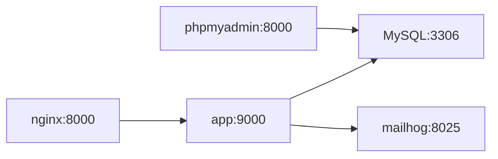

# **BASE**

## Pasos para la instalación del repositorio y ambiente de desarrollo utilizando docker

### 1. Requisitos

Por favor previamente debe tener instalado en su maquina.

- git

- docker

- docker-compose

### 2. Instalación

#### 2.1 Contenedores

- Clone el repositorio. `git clone git@github.com:jagscol/base.git`

- Copie el archivo con las variables de entorno. `cp .env.example .env`

- De ser necesario edite el archivo `.env` y personalice los puerto que usara docker para que no entre en conflicto con los puertos locales de su maquina.

- Ejecute para construir sus contenedores. `docker-compose up --detach --build --remove-orphans`

#### 2.2 Laravel

- Instale los paquetes de php necesarios `docker-compose exec app composer install`

- Instale los paquetes de node necesarios `docker-compose exec app npm install`

- Instale los paquetes de node necesarios `docker-compose exec app npm run dev`

- Corra las migraciones y seeders `docker-compose exec app php artisan migrate:fresh --seed`

### 3. Ejecución

#### 3.1 Ejecución de procesos

Si usted desea ingresar y ejecutar procesos dentro de los contenedores ingrese a ellos por medio de estos comandos

- Laravel `docker-compose exec app bash`

- MySQL `docker-compose exec mysql bash`

#### 3.2 Ejecución de interface de aplicativos

- Laravel [localhost:8000](localhost:8000) (este puerto esta configurado en el archivo .env como NGINX_PORT=8080)

- phpMyAdmin [localhost:8080](localhost:8080) (este puerto esta configurado en el archivo .env como PHPMYADMIN_PORT=8080)

- Mailhog [localhost:8025](localhost:8025) (este puerto esta configurado en el archivo .env como MAILHOG_WEB_PORT=8080)

### 4. Diagrama de contenedores

